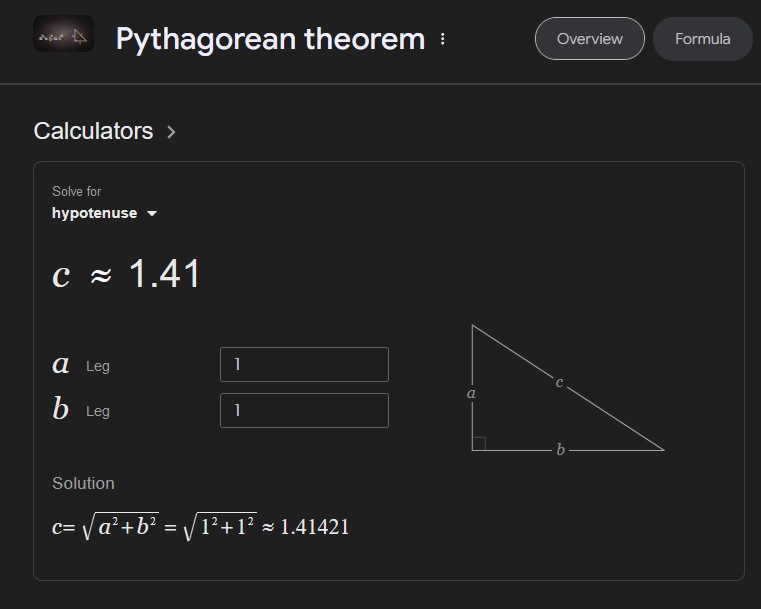

# 04: Pathfinding

For the next couple of classes we are going to be learning about the A* ("A-star") pathfinding algorithm. A* is an algorithm that is very commonly used in video games, as it allows game entities to navigate complex and dynamic spaces through a series of shortcut decisions that approximate an optimal path from one location to another. 

In the context of our maze game, A* will allow the monster to traverse the procedurally generated maze in a hunt for the player. He's coming for you!

## Understanding Graphs

A* operates on a data structure called a **weighted graph**. A weighted graph consists of a set of nodes connected by **edges**, where the **edges** between the nodes are assigned some **weight**. Think of the weight of an edge as the **difficulty of traversing it**. See the link for a visual representation of a weighted graph:

> Resource: <https://en.wikipedia.org/wiki/Graph_(discrete_mathematics)#/media/File:Weighted_network.svg>

In the image above, the edges with **high** weights (3 & 4) are considered **harder to traverse** than edges with low weights (1 & 2).

A great analogy for this is to think of a collection of towns connected by roads. If **each node is a town**, the **edges are roads** connecting them. Roads with a high weight might be muddy dirt paths that are slow and tedious to travel down (and ocassionally your wheel falls off), while roads with a low weight are super-highways where cars zip by at maximum speed and efficiency.

The A* algorithm looks at a weighted graph such as this, and uses a **heuristic** to determine an efficient path through the graph.

## Heuristics

A heuristic - apart from being a cool sounding word - is simply an algorithm that approximates an optimal solution to a problem given a finite amount of time and memory.

Human brains are really, _really_ good at using heuristics, and this is why we can do things like determine how someone is feeling almost instantly by their body language, or return a tennis ball being hit at us. Our subconscious makes decisions based on heuristics constantly, given that we live in the real world, where failing to react to certain situations in time can have life-threatening consequences. You don't have time to consciously consider every nuance of the face of someone who is angry with you - you need to know immediately whether or not they are potentially going to hurt you.

So how does this relate to our procedural horror game?

Turns out, computers can use heuristics too. Sometimes (just like with people) it's totally inefficient for a computer to exhaustively consider every possible solution to a given problem. A* analyses a weighted graph using a heuristic to constantly estimate the shortest available path to a given node. It's like a shortcut that allows the computer to come up with an answer that's "good enough" (and potentially even optimal!)

Cool, so how does all this actually work?

## The Details

First, we need a weighted graph to navigate. 

**We will do an in-class demonstration to make this more digestable.**

Once we have a weighted graph, we choose a start node and and end node. The A* algorithm then runs and determines an efficient path from start to end. Today we will focus on generating the graph, then in the next class we will start delving into coding the algorithm. Before we create the graph though, it's important to know how the algorithm is going to work.

First, from the **start node** we look at its **neighbours** (the nodes that it is connected to) and attribute something to each of them called the **gCost** - this is how far the node is from the **starting node** - typical gCost calculations use different values for **straight** or **diagonal** moves - we'll use **10** for a straight move and **14** for a diagonal move. (if you're wondering why these numbers, it's because of a little thing called trigonometry: ).

Next, each node gets an **hCost**, which is the **heuristic** - this is the **estimated** distance from the **current node** to the **end node**. You can count these off as moves horizontally, vertically or diagonally.

Finally, we calculate each node's **fCost** which is simply **fCost = gCost + hCost**. fCost gives the algorithm a number for how "worth it" it is to move to that node. If fCost is low, the **cost to move** to that node from the start node is **low** and it gets us **closer** to the end node. If fCost is high, either the node is **very expensive** to navigate to, or the node we are considering is **far away** from the end node.

At each step of the pathfinding, the algorithm takes the **current node** and considers all of its **neighbours** - top and bottom, both sides, and diagonals. First, if any of the neighbours is the **goal** it moves to it and it's done; if not, it takes the path with the lowest **fCost** and then repeats. If there is a choice of **equal fCost** values, it will then choose the one with the lowest **hCost** (or closest to the goal). If everything is equal between two nodes, it will evaluate both sets of neighbours.

The algorithm uses **recursion** to keep performing this calculation until it reaches the end node. At each step, it will take the option with the lowest fCost. Because A* holds all of the visited nodes in memory, it can jump back to earlier paths if it reaches a point where the fCosts are growing too large.

> Example of gCost calculations: <https://miro.medium.com/v2/resize:fit:300/1*iSt-urlSaXDABqhXX6xveQ.png>

> Interactive A* visualizer: <https://algo-vz.netlify.app/#>


## Structure

With the theory in mind, let's start planning out how this would actually be structured in our code.

**This will also be a collaborative problem solving session.**

Firstly, our graphs and nodes are abstract, and don't need to be associated with specific GameObjects in the scene. In Unity we can create C# scripts that don't inherit from `MonoBehaviour`. We can't attach them as components, and they lose the functionality of methods such as `Start` and `Awake`, but in the case of our graphs and nodes, these aren't necessary. Our graph nodes can be represented by a `Node` class that doesn't inherit from anything. We'll have to figure out what actually goes in that class, but that will come soon.

Secondly, we already have a 2D array of integers that represents the cells of our procedural maze. This serves as a perfect template to generate our weighted graph from, as it accurately represents how the maze is actually structured. Our graph is, at its core, a bunch of nodes interconnected by proximity. What this means is if we had a 2D array of nodes, the nodes that are next to each other in the array (horizontally, vertically and diagonally) would be considered "connected".

So that leaves us with something like this:

```csharp
public class Node {
    // Information that the node needs to store?
}

public class MazeConstructor: MonoBehaviour{
    
    public Node[,] Graph;

    // ... All of the maze constructor stuff we've done so far.
}
```

## Task 1: Node Code

Have a think about what data a `Node` should store. Have an attempt at coding the `Node` class before looking at the solution. It won't need any methods.

Some considerations to make:
- When considering a node, A* will want to know its coordinates (x & y) in the graph. Remember we can use these coordinates to infer its neighbours, and hence which other nodes it is **connected to**.
- A* will need to assign costs to the node. Remember the 3 costs that A* uses. These will need to be recorded on the node itself.
- A* will need to know which node it **came from** when considering a node, so that it can trace back the path once a solution has been found.
- If we are using our 2D data array to generate our graph, some of the nodes will be closed (because there are walls in the way). These nodes should not be considered when performing pathfinding, so the node needs to be able to indicate that it is blocked off (not walkable).
- Since it's not a MonoBehaviour that's being handled by Unity, our Node will also need a C# constructor. Useful things we will want to set when constructing the node are the x and y coordinates within the graph, and whether or not the node is walkable. Other fields will be set by A* as it runs its algorithm.

<details>

<summary>Solution Example</summary>

```csharp

public class Node {
    public int x; // x coordinate on the graph.
    public int y; // y coordinate on the graph.

    public int gCost; // How far away the node is from the starting node.
    public int hCost; // How far away the node is from the end node.
    public int fCost { get {return gCost + hCost; }} // fCost is inferred by gCost and hCost.

    public Node prevNode; // This will be set by the A* algorithm - it will equal the node that was considered before this one.

    public bool isWalkable; // This will be set to false for nodes that are inside walls.

    public Node(int x, int y, bool isWalkable)
    {
        this.x = x;
        this.y = y;
        this.isWalkable = isWalkable;
    }
}

```

</details>


## Task 2: Generating the Graph

Now that we have a class for our nodes, let's go ahead and create a graph of nodes based on the data we generated in the maze constructor.

This graph will be structured as a 2D array of nodes. They should be given x and y coordinates corresponding with their position in the array, and a boolean to indicate whether or not they are walkable.

`MazeConstructor` should generate the graph once it has procedurally generated the maze data. I recommend inserting a break point into your code at the end of your `GenerateNodeGraph` function to give yourself a visualization of how the graph has turned out.

> Resource: <https://learn.microsoft.com/en-us/visualstudio/debugger/using-breakpoints?view=vs-2022>

**Starter code:**

```csharp

public class MazeConstructor: MonoBehaviour{
    
    public Node[,] Graph;

    public void GenerateNewMaze(int sizeRows, int sizeCols)
    {
       // ...Previous maze generation code.

        GenerateNodeGraph(sizeRows, sizeCols);
    }

    public void GenerateNodeGraph(int sizeRows, int sizeCols)
    {
        // TODO: Implement this function.
        // You will need to set Graph to a new 2D Node array, and populate it based on our "data" field.
    }
}

```

<details>

<summary>Solution Example</summary>

```csharp
public void GenerateNodeGraph(int sizeRows, int sizeCols)
{
    Graph = new Node[sizeRows, sizeCols];

    // Written verbosely for ease of reading:
    // Iterate over our data and make some new nodes.
    for (int i = 0; i < sizeRows; i++)
    {
        for (int j = 0; j < sizeCols; j++)
        {
            // If the cell is open, make a new node that's walkable.
            if (data[i, j] == 0)
            {
                Graph[i, j] = new Node(i, j, true);
            }
            else
            {
                // Otherwise, make the node non-walkable.
                Graph[i, j] = new Node(i, j, false);
            }
        }
    }

    Debug.Log(Graph);
}

</details>

```

## Conclusion

We have discussed and learned about the theory behind pathfinding, and begun implementing our own weighted graphs which we will navigate through to ultimately make our monster intelligently traverse the procedural maze!